<div align="center">

# 🌙 EidClean

### Smart Eid-ul-Adha Waste Management System for Abbottabad

**AI-powered waste collection, real-time driver tracking, and ML-based resource planning**

[](https://flutter.dev)
[](https://react.dev)
[](https://fastapi.tiangolo.com)
[](https://scikit-learn.org)
[](https://firebase.google.com)
[](https://railway.app)
[](https://vercel.com)
[](LICENSE)

**Final Year Project · COMSATS University Islamabad, Abbottabad Campus · 2026**

[Live Demo](#-live-deployments) · [Features](#-key-features) · [Architecture](#-system-architecture) · [Getting Started](#-getting-started)

</div>

---

## 📖 Overview

**EidClean** is an end-to-end waste management system built for **Abbottabad Municipal Corporation** to handle the massive surge in waste generated during **Eid-ul-Adha** — one of the largest waste-producing events in Pakistan.

Each year, Abbottabad district produces **over 300 tons of animal waste** in just three days. Traditional municipal planning is reactive, imprecise, and often leaves some areas overwhelmed while others sit idle. EidClean changes this with **machine learning** — predicting how much waste each locality will generate, and converting those predictions into actionable resource plans.

### The System in One Sentence

> *A citizen requests a pickup → an admin assigns a driver → the driver navigates and completes it → and meanwhile, an ML model predicts tomorrow's waste so trucks, workers, and bins are ready before the call comes in.*

---

## 🎯 Key Features

<table>
<tr>
<td width="50%">

### 🧑 Citizen Mobile App
- Firebase Authentication (Email/Password)
- Create pickup requests with:
  - GPS location + map picker
  - Photo evidence
  - Animal count
  - Time slot (Morning / Afternoon / Evening)
- Real-time status tracking
- Clean, modern Material 3 UI

</td>
<td width="50%">

### 🚛 Driver Mobile App
- Real-time task list (Firestore listeners)
- Interactive map with route visualization
- Route calculation via **OSRM** with **ORS fallback**
- One-tap task completion
- Photo upload for verification
- Daily workload summary

</td>
</tr>
<tr>
<td width="50%">

### 🏛️ Admin Dashboard
- Real-time KPI dashboard
- **Live pickup map** with color-coded pins
- **AI Resource Planning** for all 354 localities
- Batch predictions (up to 354 at once, chunked)
- Analytics with completion rate, response time, driver workload
- CSV export of predictions
- Full audit log in Firestore

</td>
<td width="50%">

### 🤖 Machine Learning Module
- **RandomForest Regressor** with 200 trees
- Trained on **PBS Census 2023** data
- **R² = 0.9733** on unseen localities
- Served via **FastAPI** on Railway
- Sub-second inference time
- Auto-generated Swagger docs

</td>
</tr>
</table>

---

## 🏗️ System Architecture

<div align="center">

```
                    ┌────────────────────────────────────────┐
                    │         ABBOTTABAD MUNICIPALITY        │
                    │           (System Users)               │
                    └────────────────┬───────────────────────┘
                                     │
          ┌──────────────────────────┼──────────────────────────┐
          │                          │                          │
          ▼                          ▼                          ▼
    ┌───────────┐             ┌───────────┐             ┌──────────────┐
    │  Citizen  │             │  Driver   │             │    Admin     │
    │  Flutter  │             │  Flutter  │             │    React     │
    │    App    │             │    App    │             │  Dashboard   │
    └─────┬─────┘             └─────┬─────┘             └──────┬───────┘
          │                         │                          │
          │                         │                          │
          ▼                         ▼                          ▼
    ┌──────────────────────────────────────────────────────────────┐
    │                    FIREBASE (Google Cloud)                   │
    │  ┌──────────┐  ┌────────────┐  ┌──────────┐  ┌────────────┐  │
    │  │   Auth   │  │ Firestore  │  │ Storage  │  │  Rules     │  │
    │  └──────────┘  └────────────┘  └──────────┘  └────────────┘  │
    └──────────────────────────────────────────────────────────────┘
                                    │
                          ┌─────────┴─────────┐
                          │                   │
                          ▼                   ▼
                  ┌───────────────┐   ┌───────────────┐
                  │  FastAPI ML   │   │  OSRM / ORS   │
                  │  on Railway   │   │   Routing     │
                  └───────┬───────┘   └───────────────┘
                          │
                          ▼
                  ┌───────────────┐
                  │  RandomForest │
                  │  Model (.pkl) │
                  └───────────────┘
```

</div>

---

## 🛠️ Tech Stack

| Layer | Technology | Why We Chose It |
|-------|-----------|-----------------|
| **Mobile** | Flutter 3.x (Dart) | Single codebase for Android, iOS, and web |
| **Frontend** | React 18 + Vite + Tailwind CSS | Fast, modern, component-driven UI |
| **Backend** | FastAPI + Python 3.13 | Async, auto-validating, auto-documenting |
| **ML** | scikit-learn, pandas, NumPy | Best-in-class for tabular data |
| **Database** | Firebase Firestore | Real-time sync, no server management |
| **Auth** | Firebase Authentication | Secure, multi-provider, generous free tier |
| **Maps** | OpenStreetMap + Leaflet | Free, open-source, no API costs |
| **Routing** | OSRM (primary) + OpenRouteService (fallback) | Free, reliable, no vendor lock-in |
| **Backend Host** | Railway | One-click deploy, GitHub integration |
| **Frontend Host** | Vercel | Auto-deploy on push, global CDN |
| **Version Control** | GitHub | Standard, enables team collaboration |

---

## 🤖 The Machine Learning Model

### The Problem

Predict how much waste (in kilograms) each of Abbottabad's **354 localities** will generate on **Eid Day 1, 2, and 3** — so that municipal trucks, workers, and bins can be allocated optimally, before waste starts piling up.

### The Dataset

| Attribute | Value |
|-----------|-------|
| Source | Pakistan Bureau of Statistics (PBS) Census 2023 |
| Localities | 354 (348 rural, 6 urban) |
| Eid Days Covered | 3 per locality |
| Total Records | 1,062 |
| Missing Values | 0 |
| Features | 5 |
| Target | Waste in kilograms (log-transformed) |

### The Features

| # | Feature | Type | Range | Importance |
|---|---------|------|-------|-----------|
| 1 | `Population_2023` | Integer | 5 – 138,715 | **55%** |
| 2 | `Estimated_Qurbani_Participation_Rate` | Float | 0.18 – 0.40 | **22%** |
| 3 | `Housing_Units` | Integer | 1 – 24,313 | **15%** |
| 4 | `Eid_Day` | Integer | 1, 2, 3 | **5%** |
| 5 | `Area_Type` (Rural/Urban) | Binary | 0 or 1 | **3%** |

### The Approach

- **Algorithm:** RandomForest Regressor (200 trees, tuned via GridSearchCV)
- **Target Transformation:** `log1p(waste)` — compresses the 5-order-of-magnitude range so small and large localities matter equally
- **Validation:** `GroupKFold` with `Locality_ID` as the group — prevents data leakage between train and test
- **Final Model:** Trained on 80% of localities, evaluated on 20% unseen
- **Deployment:** Pickled with `joblib`, loaded into FastAPI at startup, served via HTTPS

### Performance

| Metric | Value | Interpretation |
|--------|-------|----------------|
| **Test R²** | **0.9733** | Explains 97.33% of variance |
| **Test MAE** | **101.91 kg** | Average error per prediction |
| **Test RMSE** | **453.40 kg** | Penalizes large errors more |
| **CV Mean R²** | **0.9815** | Stable across folds |
| **CV Std R²** | **0.019** | Low variance = robust |

### Model vs. Alternatives

| Model | R² | Verdict |
|-------|-----|---------|
| **RandomForest** | **0.972** | ✅ **Chosen** |
| ExtraTrees | 0.971 | Slightly worse |
| GradientBoosting | 0.968 | Slower, no gain |
| HistGradientBoosting | 0.965 | Slower, no gain |
| LightGBM | 0.964 | Requires C++ toolchain |
| XGBoost | 0.962 | Extra complexity |
| Linear Regression | 0.812 | Underfits |
| KNeighbors | 0.789 | Poor for our scale |

---

## 📁 Project Structure

```
eidclean/
│
├── 📱 mobile-app/                      # Flutter application (citizen + driver)
│   ├── lib/
│   │   ├── screens/
│   │   │   ├── citizen/                # Citizen-facing UI
│   │   │   ├── driver/                 # Driver-facing UI
│   │   │   └── auth/                   # Login, register, splash
│   │   ├── services/
│   │   │   ├── routing_service.dart    # OSRM + ORS with fallback
│   │   │   ├── firestore_service.dart  # Database abstraction
│   │   │   └── auth_service.dart       # Firebase Auth wrapper
│   │   ├── models/                     # Data classes
│   │   ├── providers/                  # State management
│   │   ├── theme/                      # Brand colors, typography
│   │   └── main.dart                   # Entry point
│   ├── android/
│   ├── assets/
│   └── pubspec.yaml
│
├── 🖥️ admin-site/                      # React admin dashboard
│   ├── src/
│   │   ├── pages/
│   │   │   ├── RoleSelection.jsx       # Landing page
│   │   │   ├── AdminLogin.jsx          # Login with password toggle
│   │   │   ├── Dashboard.jsx           # Real-time KPIs + live map
│   │   │   ├── Analytics.jsx           # Charts and metrics
│   │   │   └── Predictions.jsx         # AI Resource Planning
│   │   ├── components/                 # Reusable UI components
│   │   ├── context/
│   │   │   └── AuthContext.jsx         # Auth state provider
│   │   ├── data/
│   │   │   └── localities.js           # All 354 localities
│   │   ├── firebase.js                 # Firebase init
│   │   ├── App.jsx                     # Routes
│   │   └── main.jsx
│   ├── package.json
│   └── vercel.json                     # SPA routing rules
│
├── 🧠 backend/                         # ML API (Python)
│   ├── app.py                          # FastAPI application
│   ├── requirements.txt                # Frozen dependencies
│   ├── .gitignore
│   └── ml_files/
│       ├── best_model.pkl              # Trained RandomForest (7.5 MB)
│       ├── scaler.pkl                  # StandardScaler
│       ├── kmeans.pkl                  # K-Means (for clustering experiments)
│       ├── model_metadata.json         # Features, ranges, metrics
│       ├── feature_importance.csv
│       ├── model_comparison.csv
│       └── cv_results.json
│
└── README.md                            # This file
```

---

## 🚀 Getting Started

### Prerequisites

Make sure you have installed:

| Tool | Version | Purpose |
|------|---------|---------|
| Node.js | 18+ | Admin dashboard |
| Flutter | 3.16+ | Mobile apps |
| Python | 3.11+ | ML backend |
| Git | Any | Version control |

Plus a **Firebase account** with a project created.

### 1️⃣ Clone the Repository

```bash
git clone https://github.com/TahirAhmad1002/EidClean.git
cd EidClean
```

### 2️⃣ Admin Site Setup

```bash
cd admin-site
npm install
npm run dev
```

Open **http://localhost:5173** — you'll see the RoleSelection page.

### 3️⃣ Mobile App Setup

```bash
cd mobile-app
flutter pub get
flutter run -d chrome       # For web preview
# OR
flutter run                 # For connected Android device
```

### 4️⃣ Backend Setup

```bash
cd backend
python -m venv venv

# Windows
venv\Scripts\activate

# macOS / Linux
source venv/bin/activate

pip install -r requirements.txt
python app.py
```

API runs at **http://localhost:8000**. Auto-docs at **/docs**.

### 5️⃣ Firebase Configuration

Create a Firebase project at [console.firebase.google.com](https://console.firebase.google.com) and enable:

- ✅ **Authentication** → Email/Password provider
- ✅ **Firestore Database** → Start in production mode
- ✅ **Storage** → For photo uploads

Then paste your config into:

- `admin-site/src/firebase.js`
- `mobile-app/lib/firebase_options.dart`

### 6️⃣ Firestore Security Rules

Deploy these rules in Firebase Console → Firestore → Rules:

```javascript
rules_version = '2';
service cloud.firestore {
  match /databases/{database}/documents {
    match /users/{uid} {
      allow read: if request.auth != null;
      allow write: if request.auth.uid == uid;
    }
    match /pickupRequests/{id} {
      allow read: if request.auth != null;
      allow create: if request.auth != null;
      allow update: if request.auth != null;
    }
    match /drivers/{id} {
      allow read: if request.auth != null;
      allow write: if request.auth != null;
    }
    match /predictions/{id} {
      allow read, write: if request.auth != null;
    }
  }
}
```

---

## 🌐 Live Deployments

| Component | URL | Status |
|-----------|-----|--------|
| 🏛️ **Admin Dashboard** | [eid-clean.vercel.app](https://eid-clean.vercel.app) |  |
| 🧠 **ML API** | [eidclean-production.up.railway.app](https://eidclean-production.up.railway.app) |  |
| 📖 **API Docs (Swagger)** | [eidclean-production.up.railway.app/docs](https://eidclean-production.up.railway.app/docs) |  |
| 📊 **API Info Endpoint** | [eidclean-production.up.railway.app/info](https://eidclean-production.up.railway.app/info) |  |

**Demo credentials:** Available on request. Contact the team.

---

## 📡 API Reference

### `GET /health`

Quick health check.

```json
{ "status": "ok", "service": "EidClean Prediction API" }
```

### `GET /info`

Returns model metadata — type, features, metrics.

```json
{
  "model_type": "RandomForestRegressor",
  "target_type": "log",
  "feature_columns": [
    "Population_2023",
    "Housing_Units",
    "Estimated_Qurbani_Participation_Rate_pct",
    "Area_Type_Encoded",
    "Eid_Day"
  ],
  "metrics": {
    "test_r2": 0.9732635111507296,
    "test_mae_kg": 101.9068653203325,
    "test_rmse_kg": 453.39859198445197,
    "cv_mean_r2": 0.9815,
    "cv_std_r2": 0.019
  },
  "generated_at": "2026-10-03T18:28:01.873058"
}
```

### `POST /predict`

Predict waste and resource requirements for one locality.

**Request:**
```json
{
  "population": 5000,
  "housing": 900,
  "participation_rate": 0.28,
  "area_type": "Rural",
  "eid_day": 1
}
```

**Response:**
```json
{
  "waste_kg": 3218.86,
  "trucks": 2,
  "workers": 3,
  "bins": 17,
  "model_version": "2026-10-03T18:28:01.873058",
  "input_summary": {
    "population": 5000.0,
    "housing": 900.0,
    "participation_rate": 0.28,
    "area_type": "Rural",
    "eid_day": 1
  }
}
```

---

## 🎓 The ML Pipeline (Behind the Scenes)

The complete ML workflow spans three Jupyter notebooks:

### Notebook 1 — Data Preparation & Exploration
- Loaded PBS Census 2023 data (354 localities)
- Cleaned, encoded, and engineered features
- Performed exploratory data analysis with distributions, correlations, and outliers
- Tested K-Means clustering (rejected — no improvement)
- Benchmark of 40+ models via **LazyPredict**

### Notebook 2 — Model Training & Selection
- Trained 3 finalists: RandomForest, HistGradientBoosting, LightGBM
- Hyperparameter tuning via **GridSearchCV** (324 configurations × 5 folds = 1,620 fits)
- Validated using **GroupKFold** to prevent locality leakage
- Tested log-transformed target vs. raw target (log won)
- Computed feature importance, residual diagnostics, and CV results
- Saved 8 artifacts for deployment

### Notebook 3 — API Prototyping
- Built and tested the FastAPI service locally
- Verified identical predictions between Colab and standalone Python
- Exposed the API publicly via ngrok for integration testing

---

## 🧪 Testing

```bash
# Admin site — verify production build
cd admin-site
npm run build

# Backend — verify API health
curl https://eidclean-production.up.railway.app/health

# Backend — verify a prediction
curl -X POST https://eidclean-production.up.railway.app/predict \
  -H "Content-Type: application/json" \
  -d '{"population": 5000, "housing": 900, "participation_rate": 0.28, "area_type": "Rural", "eid_day": 1}'

# Mobile — run all tests
cd mobile-app
flutter test
```

## 📸 Screenshots

### 🏛️ Admin Dashboard — Real-Time Operations Console

The admin dashboard gives the municipal corporation a complete operational picture. Real-time KPIs, a live pickup map, and ML-driven resource planning all in one place.

<table>
<tr>
<td width="50%" align="center">
<strong>Live Dashboard</strong><br />
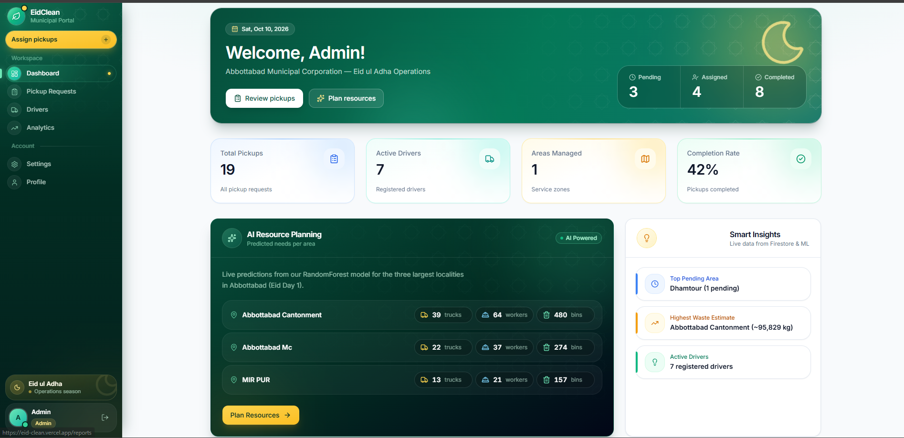
<br />
<em>Real-time KPIs: pending, assigned, completed, total pickups, active drivers, and area counts. Every number is live from Firestore.</em>
</td>
<td width="50%" align="center">
<strong>Dashboard — Detailed View</strong><br />
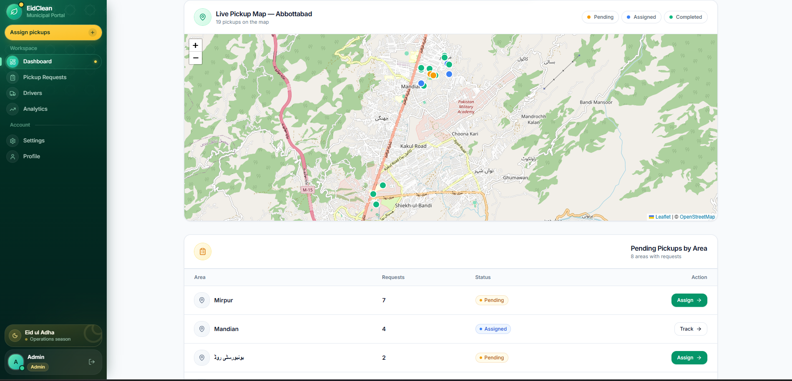
<br />
<em>Includes the AI Resource Planning preview, live pickup map with real pins, and pending pickups grouped by area.</em>
</td>
</tr>
</table>

<table>
<tr>
<td width="50%" align="center">
<strong>AI Resource Planning</strong><br />
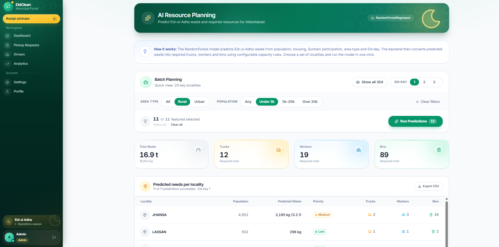
<br />
<em>The flagship page. RandomForest model predicts waste for all 354 Abbottabad localities. Batch predictions, search, filters, and CSV export.</em>
</td>
<td width="50%" align="center">
<strong>Analytics — Completion & Performance</strong><br />
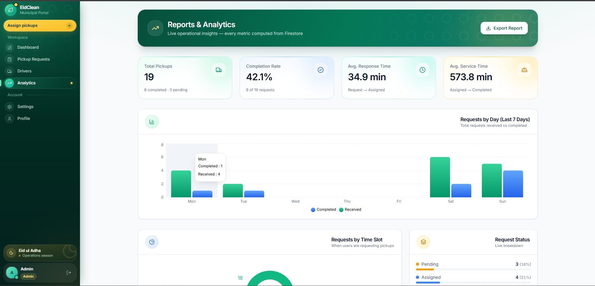
<br />
<em>Real completion rate, average response time, average service time. All metrics computed from Firestore timestamps — no hardcoded values.</em>
</td>
</tr>
</table>

<table>
<tr>
<td width="50%" align="center">
<strong>Analytics — Area Performance</strong><br />
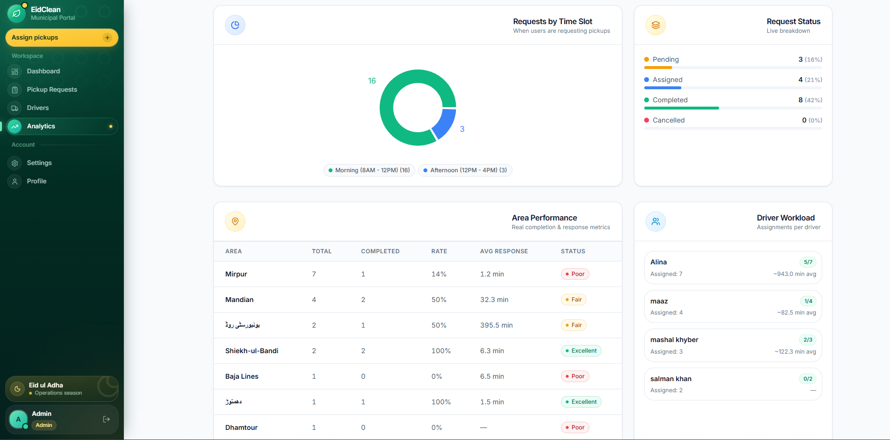
<br />
<em>Per-area breakdown with completion rates, response times, and ML district-wide forecast for Eid Day 1.</em>
</td>
<td width="50%" align="center">
<strong>Driver Workload</strong><br />
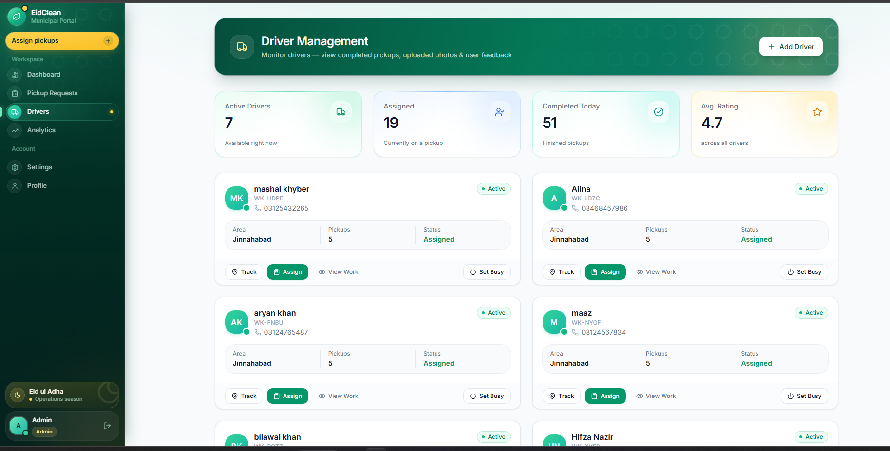
<br />
<em>Each driver's assigned and completed tasks, average service time, and current status — updated in real time.</em>
</td>
</tr>
</table>

<table>
<tr>
<td width="50%" align="center">
<strong>Pickup Requests</strong><br />
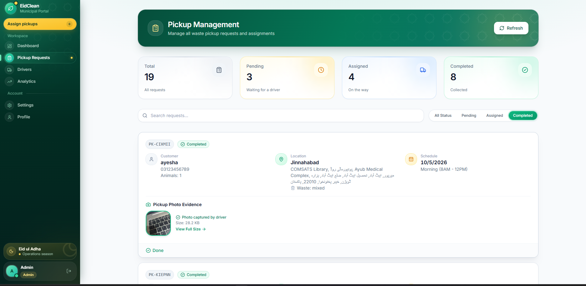
<br />
<em>Full list of incoming citizen requests with status, location, animal count, and time slot. One-click assignment to drivers.</em>
</td>
<td width="50%">
</td>
</tr>
</table>

---

### 🚛 Driver Mobile App — Navigate, Collect, Complete

The driver app is designed for field use. Large touch targets, clear route visualization, and offline-tolerant task management.

<table>
<tr>
<td width="25%" align="center">
<strong>Home — Task List</strong><br />
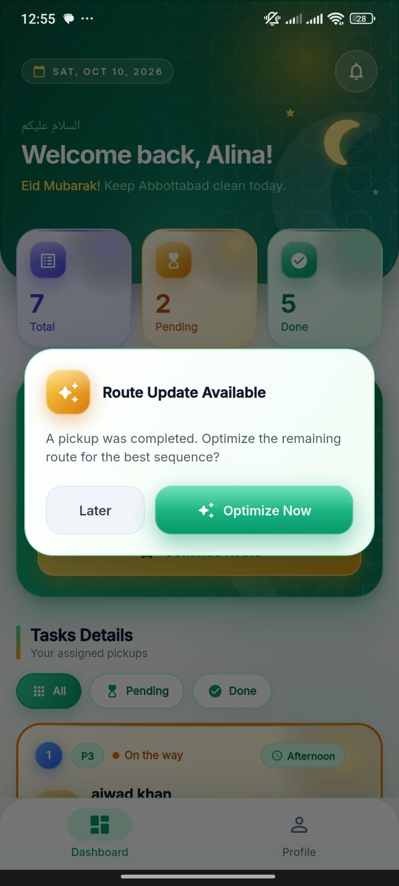
<br />
<em>Assigned pickups in real time</em>
</td>
<td width="25%" align="center">
<strong>Navigation</strong><br />
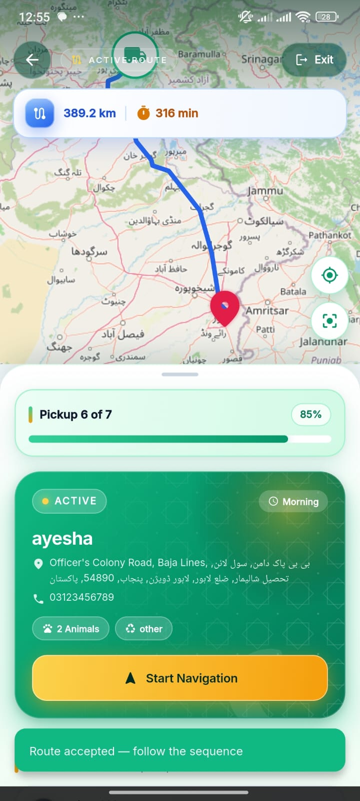
<br />
<em>Route drawn on OpenStreetMap via OSRM</em>
</td>
<td width="25%" align="center">
<strong>Route Optimization</strong><br />
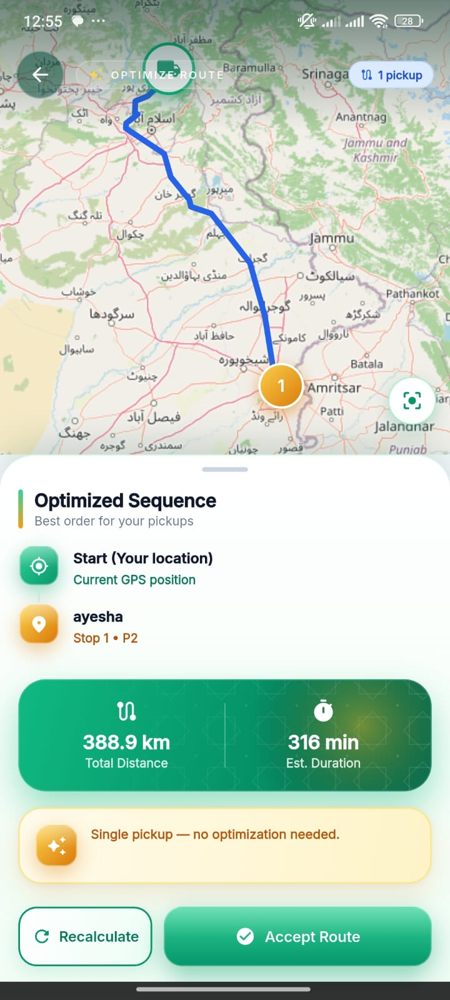
<br />
<em>Polyline route with fallback support</em>
</td>
<td width="25%" align="center">
<strong>Live Tracking</strong><br />
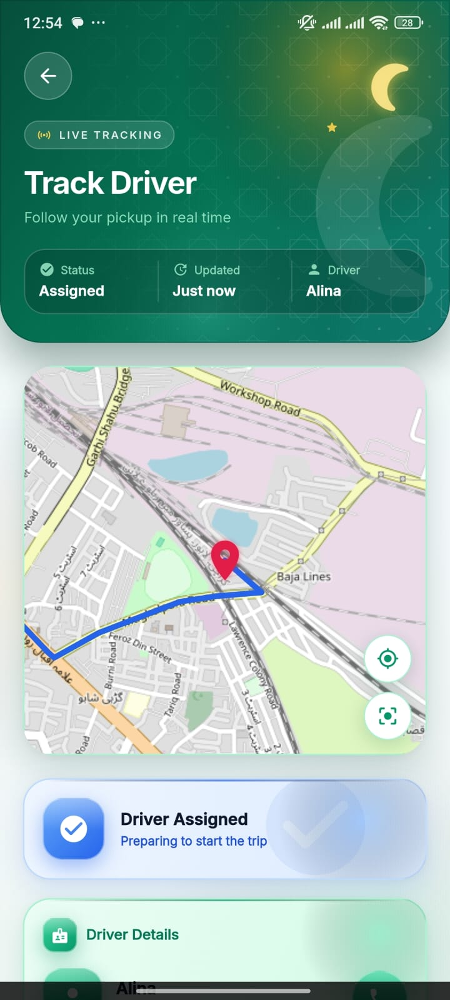
<br />
<em>Real-time location sync to Firestore</em>
</td>
</tr>
</table>

<table>
<tr>
<td width="50%" align="center">
<strong>Arrived at Location</strong><br />
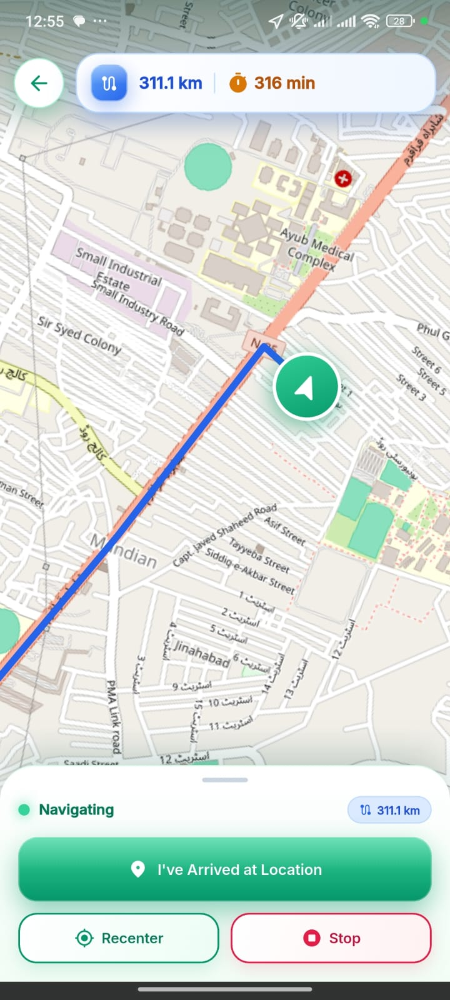
<br />
<em>Driver reaches the citizen's pickup point. Location verified against Firebase coordinates.</em>
</td>
<td width="50%" align="center">
<strong>Pickup Completed</strong><br />
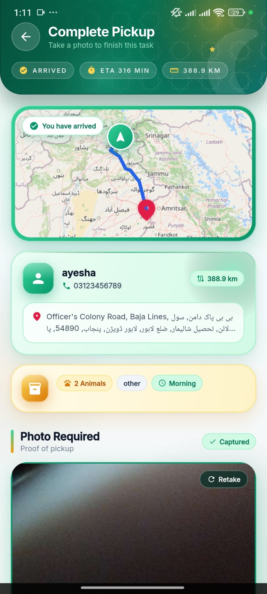
<br />
<em>Task marked complete with photo proof. Status syncs to admin dashboard in seconds.</em>
</td>
</tr>
</table>

---

### 🧑 Citizen Mobile App — Request, Track, Review

A clean, accessible interface that lets any resident of Abbottabad request a waste pickup in under a minute.

<table>
<tr>
<td width="25%" align="center">
<strong>Onboarding</strong><br />
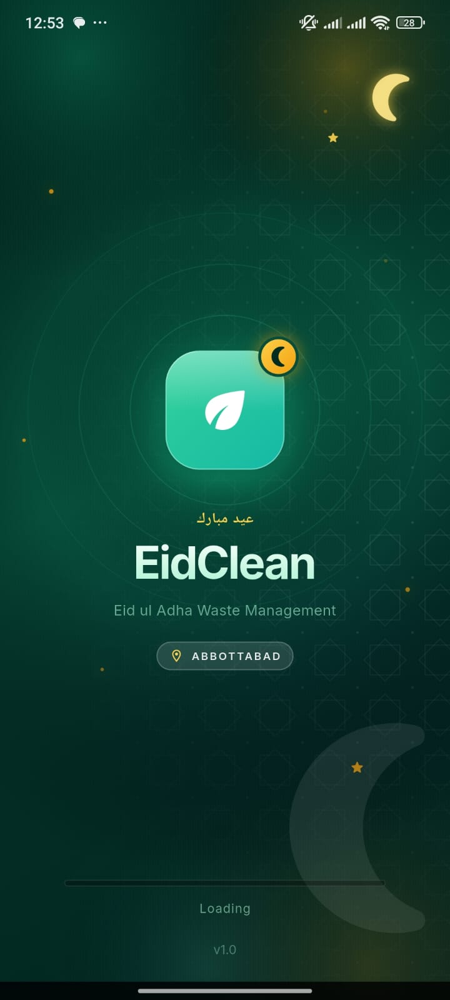
<br />
<em>Branded splash screen</em>
</td>
<td width="25%" align="center">
<strong>Sign In</strong><br />
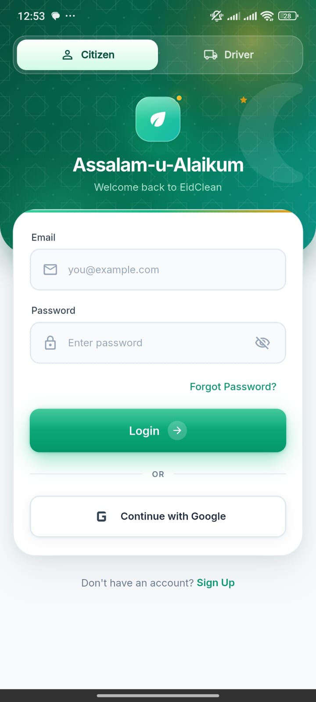
<br />
<em>Firebase Auth integration</em>
</td>
<td width="25%" align="center">
<strong>Home</strong><br />
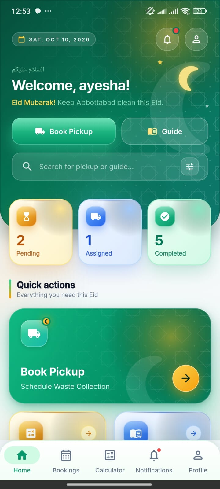
<br />
<em>Active requests and quick actions</em>
</td>
<td width="25%" align="center">
<strong>Meat Calculator</strong><br />
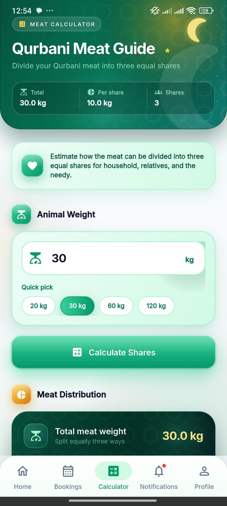
<br />
<em>Helper to estimate meat distribution</em>
</td>
</tr>
</table>

<table>
<tr>
<td width="33%" align="center">
<strong>Create Pickup Request</strong><br />
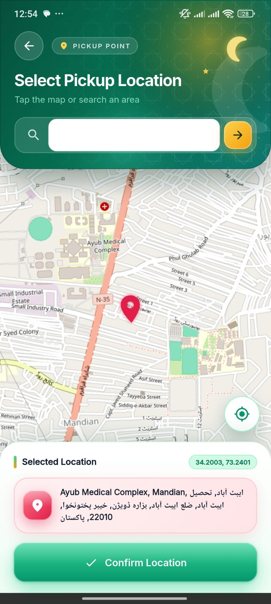
<br />
<em>Enter location, animals, photo, and time slot. GPS and map picker included.</em>
</td>
<td width="33%" align="center">
<strong>Request Submitted</strong><br />
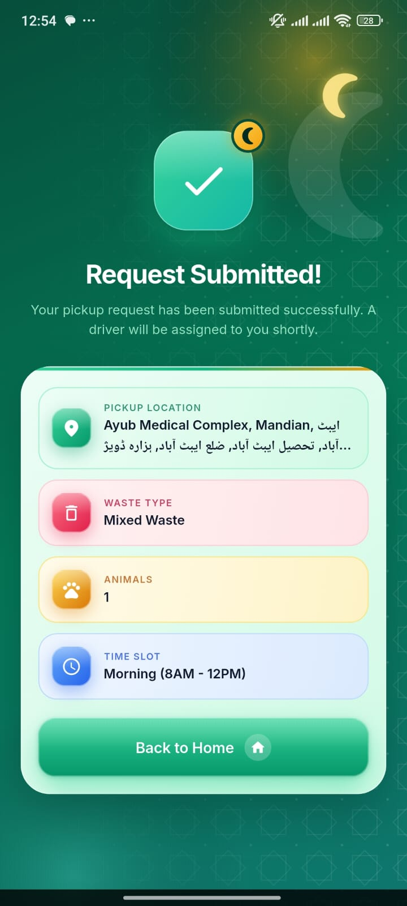
<br />
<em>Confirmation screen with reference ID. Request visible to admin immediately.</em>
</td>
<td width="34%" align="center">
<strong>Review & Feedback</strong><br />
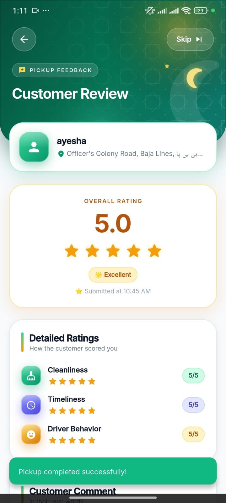
<br />
<em>Post-pickup rating to build service quality trends over time.</em>
</td>
</tr>
</table>

---
## 🔒 Security Notes

- ✅ Firebase Authentication handles all password hashing
- ✅ Firestore Security Rules restrict access by role
- ✅ Firebase API key is public by design (Firebase is designed this way — security is enforced by rules)
- ✅ ORS API key is kept in `.gitignore` and not committed
- ✅ HTTPS enforced on Vercel and Railway
- ✅ CORS configured to allow our frontend only (production)
- ✅ Input validation via Pydantic rejects out-of-range values

---

## 🚧 Roadmap / Future Work

| Feature | Priority | Status |
|---------|----------|--------|
| NGO module for meat donation management | High | 🔨 In progress |
| Android APK release on GitHub Releases | Medium | 📅 Planned |
| Multi-stop route optimization (TSP heuristic) | Medium | 📅 Planned |
| Vehicle Routing (VRP) with capacity + time windows | Low | 📅 Planned |
| IoT weight sensors on collection trucks | Low | 💡 Idea |
| Live traffic integration via CRP algorithm | Low | 💡 Idea |
| Turn-by-turn voice navigation | Low | 💡 Idea |
| Multi-language support (Urdu, English) | Medium | 📅 Planned |

---

## 📚 Documentation

- **[ML Methodology](docs/ML_METHODOLOGY.md)** — Full explanation of the model and training pipeline
- **[API Reference](docs/API.md)** — Detailed endpoint documentation
- **[Deployment Guide](docs/DEPLOYMENT.md)** — How to deploy on Railway and Vercel
- **[Contributing Guide](CONTRIBUTING.md)** — How to contribute (if open-source)

---

## 👥 Team

<table>
<tr>
<td align="center" width="33%">
<br />
<strong>Tahir Ahmad</strong><br />
<em>ML Engineer · Backend · Admin Dashboard</em><br />
<a href="https://github.com/TahirAhmad1002">@TahirAhmad1002</a>
</td>
<td align="center" width="33%">
<br />
<strong>Hifza Nazir</strong><br />
<em>Mobile App UI · Citizen & Driver Flows</em>
</td>
<td align="center" width="33%">
<br />
<strong>Memmona Ashraf</strong><br />
<em>Mobile App Features · Documentation</em>
</td>
</tr>
</table>

### 🎓 Supervisor

**Syed Shahab Zarin**  
Department of Computer Science  
COMSATS University Islamabad, Abbottabad Campus

---

## 📄 License

This project is released under the **MIT License** — see the [LICENSE](LICENSE) file for details.

Copyright © 2026 **Tahir Ahmad, Hifza Nazir, Memmona Ashraf**

---

## 🙏 Acknowledgments

- **Pakistan Bureau of Statistics (PBS)** — for the Census 2023 dataset
- **OpenStreetMap contributors** — for the map tiles
- **OSRM team** — for the open-source routing engine
- **OpenRouteService (HeiGIT)** — for the fallback routing API
- **Railway** and **Vercel** — for free hosting that made this project possible
- **Firebase team** — for the real-time database
- The **scikit-learn**, **FastAPI**, **Flutter**, and **React** communities

---

<div align="center">

### 🌙 Made with 💚 in Abbottabad, Pakistan

*For a cleaner, smarter Eid-ul-Adha — year after year.*

**[⬆ Back to Top](#-eidclean)**

</div>
